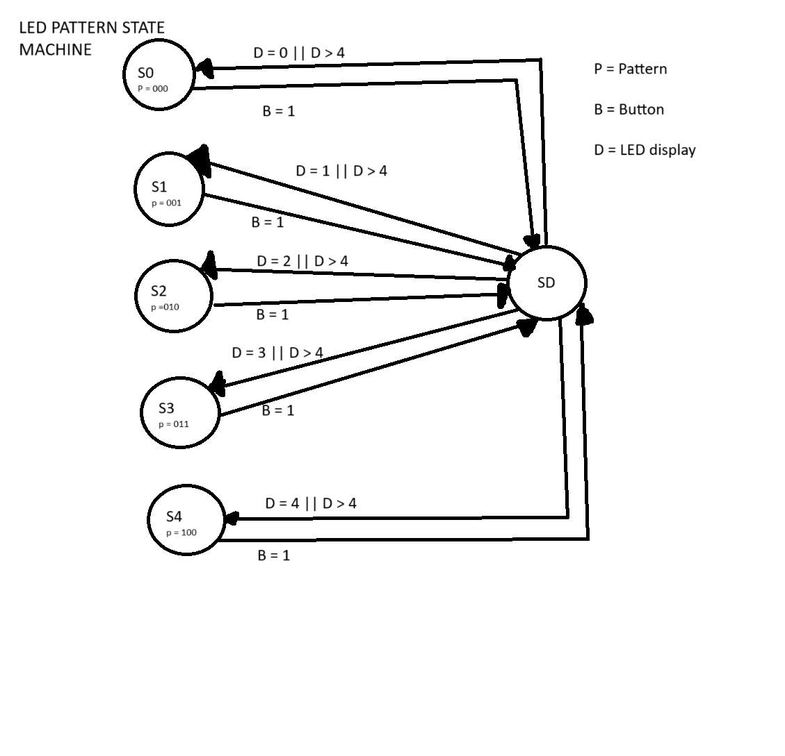

# Lab 4 #

## Overview ##

Created an Led pattern chooser 

## Functional Requirements ##

The pattern of the leds changes to a pattern dictated by the arrangment of the switches after the key1 button is pressed

### LED requirments ###

1) LED 7 always blinks at 1 * base rate

2) The state machine has five states running at different rates

2) State 0: runs at 1/2  * base rate and has a circular right shifting pattern

3) State 1: runs at 1/4 * base rate and has a circular left shifting pattern

4) State 2: runs at 2 * base rate and has a 7-bit up counter pattern

5) State 3: runs at 1/8 * base rate and has a 7-bit down counter pattern

6) State 4: cutsom state

7) There is also a transition state, when the button is pressed the switch pattern shows for a second. If a switch pattern beyond 0100 is selected then the previous state continues

### Conditioned Push-Button Signal ###

1) once the key1 button is pressed the signal is synchronized, debounced, and then creates a simple pulse with a period of 1 regarless of how many times it bounces.

### Architecture ###

Refer to the Block diagram and state machine diagram below

### Implementation Details ###

The custom state runs at 1/4 * base rate and has a 65 - 34 - 20 - 8 binary pattern

## Deliverables ##

### Synchonrizer ##

The screenshots for this were submitted in hw 3

### Block Diagram ###

### State machine diagram ###

### Questions ###

No questions asked for this assignment - SKIBIDI SIGMA